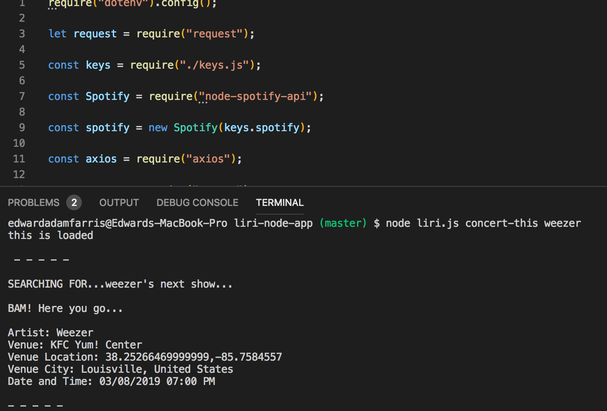
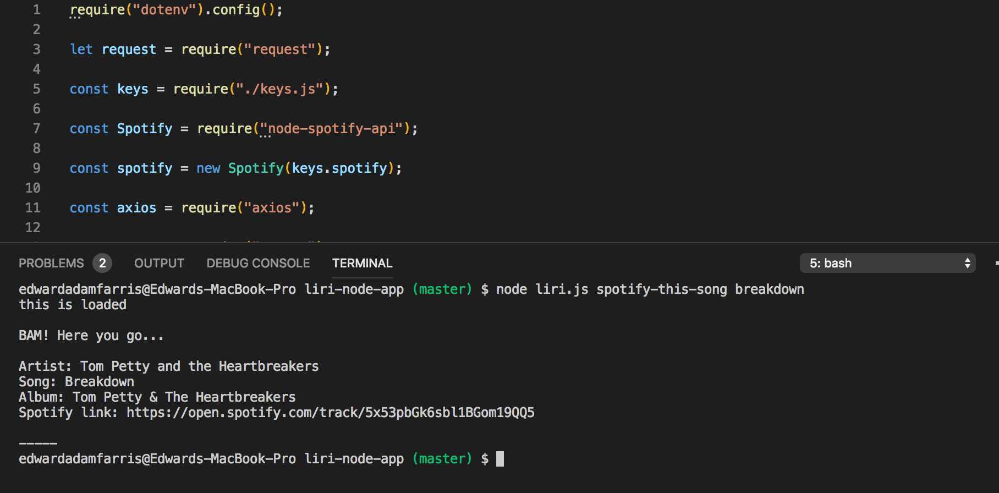
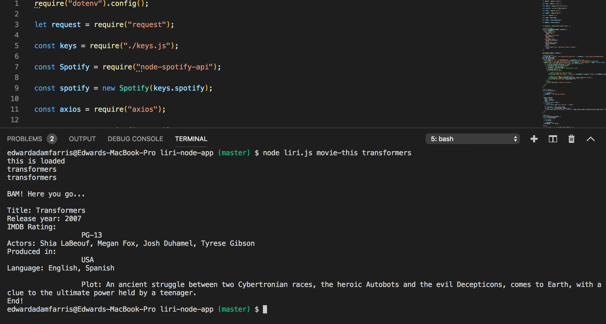
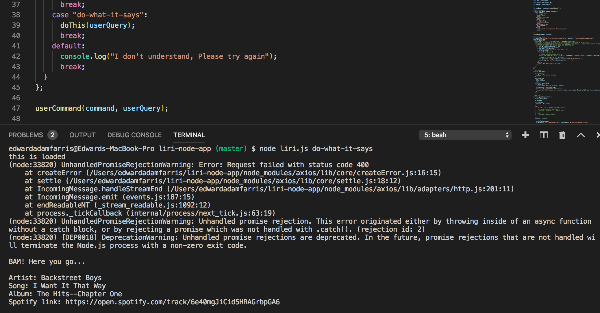

# liri-node-app

Link to page: https://edwardfarris.github.io/liri-node-app/
<ul>
<li>For: University of Arizona Coding Bootcamp</li>
<li>Developer: Edward Adam Farris</li>
<li>Deployment Date: 1/23/19</li>
<li>Built With: Javascript, Node.js</li>
<li>APIs: OMDB, BandsInTown, Spotify</li>
<li>Node Packages: Axios, Moment, fs, request, dotenv</li>
</ul>
 

Description and Requirements:
Liri-bot is a command line application that takes user commands a returns data from APIs. Users can use the following commands to look up information about songs, concerts, and movies.
-concert-this: Utilizes the BandsInTown API to give the user information about upcoming conerts.
-spotify-this-song: Utilizes the Spotify API to return information about a song including the artist, song name, spotify link, and album.
-movie-this: Utilizes the OMBD API to take a movie name and returns the name, cast, release year, IMDB rating, country of origin, language, and plot.
-do-what-it-says: Utilizes the "readFile()" method to access data from a pre-populated .txt file and return its information as a search query.
 

Getting Started: User must install the following Node packages in order for the application to function properly
<ul>
<li>Dotenv: Command line: 'npm install dotenv'</li>
<li>Request: Command line: 'npm install request'</li>
<li>Moment: Command line: 'npm install moment'</li>
<li>Fs: Command line: 'npm i fs'</li>
<li>Axios: Command line: 'npm i axios'</li>
</ul>
 

Functionality:
1. concert-this 
<node filename command artist-name>

2. spotify-this-song 
<node filename command song-name>

3. movie-this 
<node filename command movie-name>

4. do-what-it-says 
<node filename command >

 

Notes: 
This was my first back end project and I found it very challenging. The most difficult challenge was to return the proper information for the "movie-this" command. Specifically, there were issues getting the rotten tomatoes rating returned. Another challenge was keeping track of all the different files and properly linking them to one another as well as making sure all the proper Node packages were installed correctly. Overall, it was good practice for utilizing the command line and I hope to improve the functionality in the future.